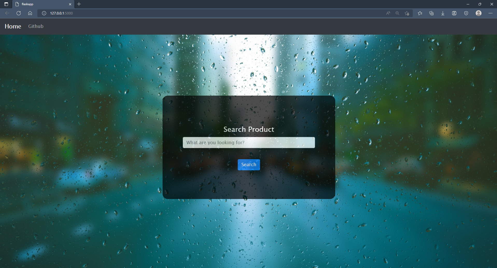
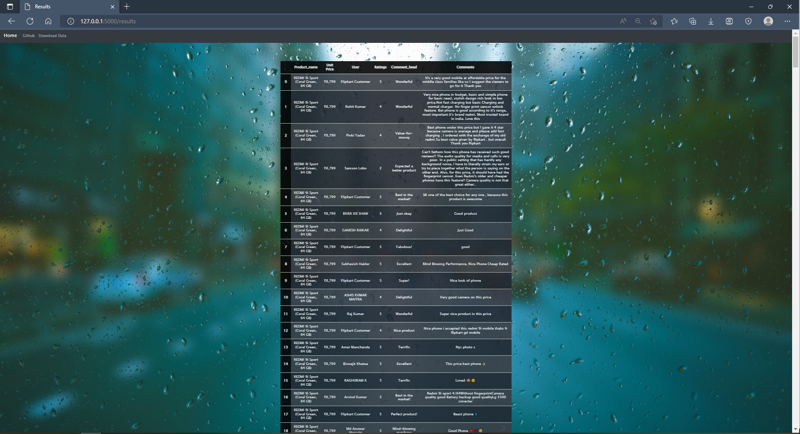

## It is a Flask Application to webscrap data 

- ## Link to the app:
- [Heroku link] (https://flipscraper.herokuapp.com/)

- ### Some Ideas and codes are taken from the following:

1. **_For HTML, CSS and CSV files_**(with some modifications)
- [Github link] (https://github.com/c17hawke/flask-based-wordcloud-generator) 

2. **_Corey Schaefer_**
- [BeautifulSoup] (https://www.youtube.com/watch?v=ng2o98k983k&t=13s)

3. **_Krish Naik_**
- [Web Scraping video 1] (https://www.youtube.com/watch?v=zHjnc2ZwbGA&t=297s)
- [Web Scraping video 2] (https://www.youtube.com/watch?v=syTIzS4AIpM&t=156s)

- ### What this App does?
This application will pull data from e-commerce site(flipkart) on the basis of the user search. It will take the top 5 product search by the user and then for each product it will fetch upto top 60 reviews. Then it will store them in a **MongoDB** database and there it will draw the result and display that. At the display the user also will be able to download the result in `.csv` file format. After showing the result it will delete the  record in the database to save space in **MongoDB** database. A copy of this result will be stored in the location `Flask_Webscrapper/static/CSVs` in `.csv` format, which will get replaced by the next new search result. And all these tasks will get recorded in a **log file** which is stored in `Flask_Webscrapper/Server_log`.

- ### Images of the application:

- **Home page**:

- **Search page**:

#### Also an example of a search result is there named **redmi_phones.csv** file.